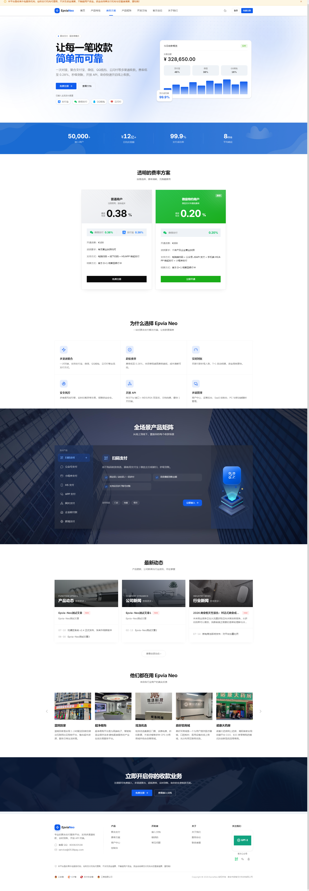

<div align="center">

<h1>Szy_Pay</h1>

<p><b>易支付 · 聚合支付 · 商户进件 一体化支付通道平台</b></p>

<p><i>让每一笔收款，都简单可靠。</i></p>

<p>
  
  
  
  
  
</p>

<p>
  <sub>
    易支付 · 聚合支付系统 · 支付网关 · 支付通道 · 商户进件 · 微信服务商进件 ·
    特约商户进件 · 收银台 · 分账 · 代付 · 结算对账 · 商户中心 · Go + Vue 3
  </sub>
</p>

</div>

---

## 📖 关于 Szy_Pay

**Szy_Pay** 是一套面向数字商业的**电子支付通道平台**：对上聚合各家支付渠道，对下给商户一套统一的收款接口、收银台与自助中心，把订单、回调、结算、对账、风控这些繁杂环节收敛成开箱即用的服务。

它覆盖了一个**易支付 / 聚合支付系统**该有的完整链路，并在此之上把**商户进件（服务商模式）**做成了主线能力 —— 每个商户在平台服务商名下进件、拿到自己的子商户号，资金由上游**直清到商户自己的账户**，资金不经平台账户中转。

**适合谁**

- 想搭建自有**支付网关 / 聚合收款平台**的团队；
- 需要**服务商模式商户进件**（微信特约商户 `sub_mchid`、直连通道子商户号）的服务商；
- 想研究现代化支付系统工程实现（Go 后端 + Vue 3 前端）的开发者。

---

## ✨ 核心能力

| | 能力 | 说明 |
|:---:|---|---|
| 🔗 | **统一收款接入** | 一套接口聚合多渠道多形态（扫码 / JSAPI / H5 / APP / 付款码 / 收银台），一次接入覆盖全场景。 |
| 🏦 | **商户进件（服务商模式）** | 商户在平台服务商名下进件，落地自己的子商户号，**一户一号、资金直清**到商户本人账户。 |
| 🛡️ | **进件风控与业务管控** | 进件驳回逐字段回显、子商户业务受限状态查询与快照、受限即锁收单，处置通知实时订阅。 |
| 📣 | **消费者投诉管理** | 微信消费者投诉 2.0 全闭环：工单台、协商记录、回复与传图、退款审批、站内信触达。 |
| 📊 | **清晰的资金视图** | 订单、流水、结算、对账、分账、代付一目了然，钱从哪来、去哪、何时到账都查得清。 |
| 🧭 | **自助式商户中心** | 注册、进件、配置、查询、提现、退款全流程自助，把控制权交回商户手里。 |
| 🛠️ | **稳健的运营后台** | 通道 / 商户 / 订单 / 结算 / 风控 / 内容运营一站式管理控制台。 |
| 📚 | **现代化开发体验** | 规范的接口约定与在线接入文档，技术团队少走弯路。 |

> 我们相信，好的支付平台应该是「安静」的 —— 它在后台稳稳运转，让商户几乎感觉不到它的存在，只需专注于自己的生意。

---

## 🌟 近期特色功能

> 这三块是近期投入最多的方向 —— 它们共同回答同一个问题：**如何让平台既能规模化接商户，又始终把每一笔钱清楚地留在商户自己手里。**

### 🏦 服务商商户进件（一户一号 · 资金直清）

平台以**服务商模式**接入渠道，为每个商户**单独进件、单独持号**：商户在平台服务商名下完成进件，拿到属于自己的子商户号，收款资金由渠道**直接结算到商户本人的银行账户**。

```
 商户提交资料   →    渠道进件审核    →    子商户号下发    →   通道对该商户开通  →  收款直接入商户账户
 （加密落库）      （逐字段驳回回显）    （回填全链路生效）    （未开通即不可用）    （平台账户无资金停留）
```

| 特性 | 说明 |
|---|---|
| **两档进件方式** | 既支持后台代录资料的半自动进件，也支持对接渠道进件接口（如微信 `applyment4sub`）全自动提单。 |
| **一户一号** | 进件成功即回填商户自己的子商户号（微信 `sub_mchid`、直连渠道各自号段），下单 / 退款 / 结算 / 分账全链路统一使用该号。 |
| **资金直清** | 收款按渠道规则直接结算至商户自己的账户主体，平台账户无资金停留。 |
| **进度如实可视** | 进件状态贴合渠道真实阶段（资料审核 → 待账户验证 → 待签约 → 已开通），不用「处理中」一词糊过去。 |
| **敏感信息合规** | 身份证、银行账号等敏感字段加密落库，页面回显一律脱敏。 |
| **多渠道适配** | 各渠道子商户号字段名、资料结构、行业类目各不相同，进件层统一抽象，新增渠道只需登记映射。 |

> **硬约束**：未进件成功的商户，该通道对他不可用、下单直接拒绝，且**不会退回使用平台自己的商户号**收款。

### 🛡️ 进件风控与业务受限管控

进件不是提交完就结束。商户开通之后，渠道随时可能因风控对其**限制收款、限制退款、限制提现**，平台必须比商户更早知道。

| 环节 | 我们的做法 |
|---|---|
| **驳回看得懂** | 渠道驳回逐字段回显（字段名 + 具体驳回理由），商户端与运营后台都能直接看出该改哪一项，改完原地重提，不必重走流程。 |
| **受限查得到** | 定时拉取子商户的业务受限状态（收款 / 退款 / 提现 / 分账等维度）并留存快照，运营后台概览 + 明细抽屉一眼看全，商户端也有自查面板。 |
| **受限锁得住** | 一旦识别为受限，收单、退款、提现、分账等关键动作在业务侧即时硬锁，既不会明知失败还去打渠道接口，也不会绕道其他收款方式。 |
| **处置留得下** | 订阅渠道的**违规处置通知**与**合作伙伴管控通知**回调，验签解密后写入追加型流水，处置与解除的时间线完整可回溯。 |
| **补正做得了** | 受限后常见的补正场景（变更结算账户、变更主体资料）提供自助入口，商户自己就能发起，无需线下往返。 |

> 通知回调与定时对账**双通道兜底**：既吃渠道推送，也主动轮询刷新，不依赖单一来源。

### 📣 消费者投诉全闭环（微信投诉 2.0）

投诉处理不及时会直接影响商户的渠道评级。我们把投诉从「渠道后台单独登录处理」搬进平台，运营与商户在同一套系统里闭环。

| 环节 | 我们的做法 |
|---|---|
| **投诉工单台** | 统计概览 + 按状态分类 + 详情抽屉，与投诉人的协商历史按时间线完整展开。 |
| **完整处置动作** | 回复投诉人、上传凭证图片、发起退款审批、响应即时服务，处置动作一站做完。 |
| **不漏单** | 投诉通知回调实时入库（按通知顶层 ID 幂等去重），另有定时对账刷新快照兜底。 |
| **商户自助** | 商户可查看并处理自己名下的投诉，跨商户越权访问在服务端直接拦截。 |
| **主动提醒** | 新投诉与状态变化即时推送到商户站内信，不靠人工盯后台。 |

> 投诉人手机号等隐私信息加密存储、列表脱敏展示（保留前 3 后 4 位），既能联系也不过度暴露。

---

## 🧩 功能全景

<table>
<tr><td valign="top" width="33%">

**收单与交易**

- 统一下单接口（V1 / V2 协议）
- 收银台与聚合收款码
- 扫码 / JSAPI / H5 / APP / 付款码
- 异步回调与商户通知重推
- 订单查询、补单、改状态、冻结
- 退款（手动 / API）与退款查询

</td><td valign="top" width="33%">

**通道与商户**

- 通道管理、子通道、轮询组
- 用户组通道分配与费率覆盖
- 商户管理、余额充扣、密钥
- 商户进件与子商户号管理
- 插件化渠道接入（元数据驱动表单）
- 支付方式与公众号 / 小程序配置

</td><td valign="top" width="33%">

**资金与运营**

- 结算批次、自动结算、提现
- 分账（多接收方拆分）与代付
- 风控：黑名单 / 关键词 / 域名白名单
- 统计报表、登录日志、操作审计
- 站内信、邮件通知、消费者投诉
- 官网 CMS、开发文档、内容运营

</td></tr>
</table>

---

## 🌱 我们的故事

Szy_Pay 始于一个朴素的观察：**收款本不该这么难。**

对很多团队来说，把在线收款跑通，意味着要在纷繁的渠道、术语、进件材料和对账规则里反复摸索，把大量精力耗在与核心业务无关的地方。我们想改变这一点。

于是我们从零开始，用现代化的工程方法构建了这套支付通道平台 —— 认真思考「一笔钱应该怎样安全、清晰地从付款人走到商户账户」这个最本质的问题。我们在稳定性、资金安全和使用体验上反复打磨，宁可慢一点，也要把每一个环节做扎实。尤其在**合规**上不走捷径：坚持一户一号、资金直清，让「钱不经平台中转」成为架构本身的约束，而不只是一句承诺。

Szy_Pay 是这份坚持的结果，也是一个仍在持续生长的平台。我们把 **「让每一笔收款，都简单可靠」** 作为信条，一步一步把它做得更好。

> 💡 **一点致意** —— 谨向所有在支付领域默默铺路的开源项目与开发者致敬。正是这些前行者点亮了我们的思路，激励我们以自己的方式，去探索一条更现代的支付之路。

---

## 🧱 技术构成

Szy_Pay 采用前后端分离架构，以现代化的技术栈构建：

| 层次 | 技术 | 说明 |
|---|---|---|
| **后端** | Go | 高并发、内存安全，胜任支付场景对稳定与性能的要求。 |
| **前端** | Vue 3 + TypeScript | 组件化、类型安全，构建清爽流畅的管理与自助界面。 |
| **构建** | Vite + Tailwind CSS | 现代化前端工程与一致的视觉体系。 |
| **数据** | MySQL（utf8mb4） | 金额一律走精确十进制，杜绝浮点误差。 |
| **安全** | RSA / SHA256 / AES-GCM | 渠道报文签名验签、回调解密、敏感字段加密落库。 |

**三端结构**

- **运营后台** —— 平台方的管理控制台：通道、商户、订单、结算、风控、进件、投诉；
- **商户中心** —— 商户自助端：接入配置、进件、账单、提现、退款、受限自查；
- **官网 / 收银台** —— 品牌门面、开发文档与面向付款人的支付页。

---

## 🖥️ 界面预览

> 以下截图取自项目演示环境，数据仅供展示。

<div align="center">



<sub>官网首页 · 品牌门面与产品介绍</sub>

</div>

---

## 💬 项目交流群

如果你对本项目感兴趣，欢迎加入我们的 **QQ 交流群**。我们期待遇见这样的你：

- 💻 **技术同好** —— 对支付系统、后端架构或前端工程感兴趣，想一起聊聊项目的设计与实现；
- 🤝 **共建伙伴** —— 认同我们的方向，有意愿参与共同开发，一起把平台打磨得更好；
- 🌟 **支持与赞助** —— 愿意为项目的成长提供资源或赞助支持，我们诚挚欢迎并期待长期同行。

无论你是想了解进展、交流想法，还是寻求合作，这里都有你的位置。

- **QQ 群号**：`632585359`

<div align="center">


<sub>扫码加入 Szy_Pay QQ 交流群</sub>

</div>

> 群内交流请遵守相关法律法规，理性讨论、友善互助。

---

## 🏷️ 品牌

| | |
|---|---|
| **名称** | Szy_Pay |
| **定位** | 易支付 · 聚合支付 · 商户进件 一体化支付通道平台 |
| **信条** | 让每一笔收款，都简单可靠 |
| **产品分级** | Szy_Pay Lite · Szy_Pay Pro · Szy_Pay Max |

---

## ❤️ 支持与赞助

Szy_Pay 是一个由热爱驱动、持续投入打磨的项目。每一处细节的完善、每一次稳定性的提升，背后都是实打实的时间与心力。

如果这个项目对你有帮助，或者你认同我们想做的事，欢迎以任何方式支持它：

- ⭐ **点一个 Star** —— 最简单也最有力的鼓励，让更多人看见它；
- 💬 **加入交流、反馈想法** —— 你的每一条建议，都会让平台变得更好；
- 🤝 **参与共建** —— 有想法、有能力、有意愿，欢迎一起把它做大；
- 🎁 **赞助支持** —— 若愿意为项目的长期发展提供资源或资金支持，我们诚挚感谢，并期待与你长期同行。

> 你的每一份支持，都会成为 Szy_Pay 继续向前的底气。具体赞助方式可在交流群内联系我们。

---

## ⚖️ 免责声明

- 本项目为独立研发的电子支付通道平台，与任何第三方机构或品牌均无从属、代理或授权关系。
- 文档及演示中出现的名称、数据、示例信息仅供说明用途，不代表真实业务数据。
- 平台仅提供技术能力，**不从事资金结算业务**；实际展业须由持牌机构提供支付服务，并完成合规的商户进件。
- 请在遵守所在国家和地区相关法律法规的前提下使用与交流本项目，因使用不当产生的任何后果由使用者自行承担。

---

## 📄 文档版本

**当前版本：`v1.2.0`** · 更新日期：2026-08-06

| 版本 | 日期 | 变更说明 |
|---|---|---|
| `v1.2.0` | 2026-08-06 | 「近期特色功能」三块改为流程图 + 特性表结构化呈现，补充多渠道适配、隐私脱敏等说明；措辞与表述优化。 |
| `v1.1.0` | 2026-08-06 | 品牌名称统一为 Szy_Pay；新增「近期特色功能」（服务商商户进件 / 进件风控与业务受限管控 / 消费者投诉 2.0）；新增「功能全景」；补充数据与安全技术层、三端结构；标题与关键词优化。 |
| `v1.0.0` | 2026-07-25 | 首版说明文档：项目定位、核心能力、技术构成、界面预览、交流群、支持与赞助、免责声明。 |

> 文档版本号仅描述本说明文档自身的修订，与平台程序版本无关。

---

<div align="center">

<sub>关键词：易支付 · 聚合支付 · 支付系统 · 支付网关 · 支付通道 · 商户进件 · 微信服务商 · 特约商户进件 · 子商户号 · 收银台 · 分账 · 代付 · 结算对账 · 商户中心 · Go · Vue 3</sub>

<sub>© Szy_Pay · 保留所有权利</sub>

</div>

